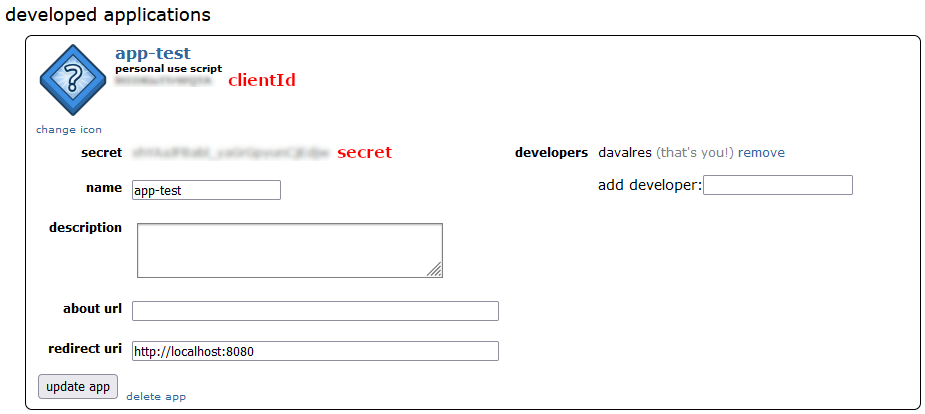

# Getting Started

## Installation

```
npm install reddit-explorer
```

## Usage

### Create a dev application on Reddit

You have to pass your app credentials, see how to generate some:

1. Go to https://www.reddit.com/prefs/apps
2. At the bottom of the page click "**create another app...**", fill all the fields and then click "**create app**". You
   now see your **clientId** and **secret**.

   

### API

#### Initializing the client
```ts
import { createRedditClient } from "reddit-explorer"

const reddit = createRedditClient({
    clientId: "<clientId>",
    secret: "<secret>",
})
```

#### Getting subreddit names
```ts
reddit.getSubredditNames({ query: "photo" })
    .then((res) => console.log("photo", res))

// photo {
//    names: [
//       'photo',
//       'photoshopbattles',
//       'photography',
//       'photocritique',
//       'photoshop',
//       'PhotoshopRequest',
//       'PhotoshopTutorials',
//       'photographs',
//       'photomarket',
//       'Photography101'
//    ]
// }
```

#### Getting the content of a subreddit
You have to pass a name and a `SortingMethod`. Sorting method can be: `Hot`, `New`, `Random`, `Rising`, `Top` or `Controversial`.

If the sorting method is `Top` or `Controversial`, you can also pass a `TimeRange`. Time range can be: `Hour`, `Day`, `Week`, `Month`, `Year`, `All`.

The package offers the type `SubredditData` which is the type of all the `[Object]` below (see at the end of the readme).
```ts
reddit
    .getSubreddit({
        name: "meme",
        sortMethod: SortingMethod.New,
    })
    .then((res) => console.log("meme", res))

// meme {
//     kind: 'Listing',
//     data: {
//     after: 't3_u9osas',
//     dist: 25,
//     modhash: '',
//     geo_filter: '',
//     children: [
//          [Object], [Object], [Object],
//          [Object], [Object], [Object],
//          [Object], [Object], [Object],
//          [Object], [Object], [Object],
//          [Object], [Object], [Object],
//          [Object], [Object], [Object],
//          [Object], [Object], [Object],
//          [Object], [Object], [Object],
//          [Object]
//       ], 
//     before: null
//    }
// }

// Example with a TimeRange:

reddit
    .getSubreddit({
       name: "meme",
       sortMethod: SortingMethod.Top,
       t: TimeRange.Day,
    })
    .then((res) => console.log("meme", res))
```

#### Loading next results

The API can only load a max amount of 25 posts. To load the next 25 posts, you have to pass the `after` param:

```ts
reddit
    .getSubreddit({
        name: "meme",
        sortMethod: SortingMethod.New,
        after: "t3_u9osas",
    })
    .then((res) => console.log("meme", res))
```

#### Include adult subreddit names

There are two ways to achieve that:

1. At the initialization of the client:
   ```ts
   import { createRedditClient } from "reddit-explorer"
   
   const reddit = createRedditClient({
       clientId: "<clientId>",
       secret: "<secret>",
       matureContent: true,
   })
   ```
2. When calling the method:

```
reddit.getSubredditNames({ query: "photo", include_over_18: true })
    .then((res) => console.log("photo", res))
```

---

#### `SubredditData` type
This type offers the possibility to handle the response more easily (`response.children[0]`):

```ts
export type SubredditData = {
    approved_at_utc: any
    subreddit: string
    selftext: string
    author_fullname: string
    saved: boolean
    mod_reason_title: any
    gilded: number
    clicked: boolean
    title: string
    link_flair_richtext: any[]
    subreddit_name_prefixed: string
    hidden: boolean
    pwls: number
    link_flair_css_class: any
    downs: number
    thumbnail_height: number
    top_awarded_type: any
    hide_score: boolean
    name: string
    quarantine: boolean
    link_flair_text_color: string
    upvote_ratio: number
    author_flair_background_color: any
    subreddit_type: string
    ups: number
    total_awards_received: number
    media_embed: null | {
        content: IFrame
        width: number
        scrolling: boolean
        height: number
    }
    thumbnail_width: number
    author_flair_template_id: any
    is_original_content: boolean
    user_reports: any[]
    secure_media: null | {
        type: string
        oembed: {
            provider_url: string
            version: string
            title: string
            type: string
            thumbnail_width: number
            height: number
            width: number
            html: IFrame
            author_name: string
            provider_name: string
            thumbnail_url: string
            thumbnail_height: number
            author_url: string
        }
    }
    is_reddit_media_domain: boolean
    is_meta: boolean
    category: any
    secure_media_embed: null | {
        content: IFrame
        width: number
        scrolling: boolean
        media_domain_url: Url
        height: number
    }
    link_flair_text: string
    can_mod_post: boolean
    score: number
    approved_by: any
    is_created_from_ads_ui: boolean
    author_premium: boolean
    thumbnail: Url
    edited: boolean
    author_flair_css_class: any
    author_flair_richtext: any[]
    gildings: {
        gid_1: number
    }
    post_hint: string
    content_categories: any
    is_self: boolean
    mod_note: any
    crosspost_parent_list?: SubredditData[]
    created: number
    link_flair_type: string
    wls: number
    removed_by_category: any
    banned_by: any
    author_flair_type: string
    domain: Url
    allow_live_comments: boolean
    selftext_html: any
    likes: any
    suggested_sort: any
    banned_at_utc: any
    url_overridden_by_dest: Url
    view_count: any
    archived: boolean
    no_follow: boolean
    is_crosspostable: boolean
    pinned: boolean
    over_18: boolean
    preview: {
        images: [
            {
                source: {
                    url: Url
                    width: number
                    height: number
                }
                resolutions: {
                    url: Url
                    width: number
                    height: number
                }[]
                variants: {
                    obfuscated: {
                        source: {
                            url: Url
                            width: number
                            height: number
                        }
                        resolutions: {
                            url: Url
                            width: number
                            height: number
                        }[]
                    }
                    nsfw: {
                        source: {
                            url: Url
                            width: number
                            height: number
                        }
                        resolutions: {
                            url: Url
                            width: number
                            height: number
                        }[]
                    }
                }
                id: string
            }
        ]
        reddit_video_preview: {
            bitrate_kbps: number
            fallback_url: string
            height: number
            width: number
            scrubber_media_url: string
            dash_url: string
            duration: number
            hls_url: string
            is_gif: boolean
            transcoding_status: string
        }
        enabled: boolean
    }
    all_awardings: any[]
    awarders: any[]
    media_only: boolean
    can_gild: boolean
    spoiler: boolean
    locked: boolean
    author_flair_text: null
    treatment_tags: []
    visited: boolean
    removed_by: null
    num_reports: null
    distinguished: null
    subreddit_id: string
    mod_reason_by: null
    removal_reason: null
    link_flair_background_color: string
    id: string
    is_robot_indexable: boolean
    report_reasons: null
    author: string
    discussion_type: null
    num_comments: number
    send_replies: boolean
    whitelist_status: string
    contest_mode: boolean
    mod_reports: []
    author_patreon_flair: boolean
    crosspost_parent?: string
    author_flair_text_color: null
    // todo: sr_detail
    permalink: string
    parent_whitelist_status: string
    stickied: boolean
    url: Url
    subreddit_subscribers: number
    created_utc: number
    num_crossposts: number
    media: null | {
        type: string
        oembed: {
            provider_url: Url
            version: string
            title: string
            type: string
            thumbnail_width: number
            height: number
            width: number
            html: IFrame
            author_name: string
            provider_name: string
            thumbnail_url: Url
            thumbnail_height: number
            author_url: Url
        }
    }
    is_video: boolean
}
```

#### Sources
Here you'll find the official documentation of the reddit official endpoints that this package uses:

- Search reddit names: https://www.reddit.com/dev/api/#GET_api_search_reddit_names
- Subreddit
   - controversial: https://www.reddit.com/dev/api/#GET_controversial
   - hot: https://www.reddit.com/dev/api/#GET_hot
   - new: https://www.reddit.com/dev/api/#GET_new
   - random: https://www.reddit.com/dev/api/#GET_random
   - rising: https://www.reddit.com/dev/api/#GET_rising
   - top: https://www.reddit.com/dev/api/#GET_top
   - sort: https://www.reddit.com/dev/api/#GET_{sort}
